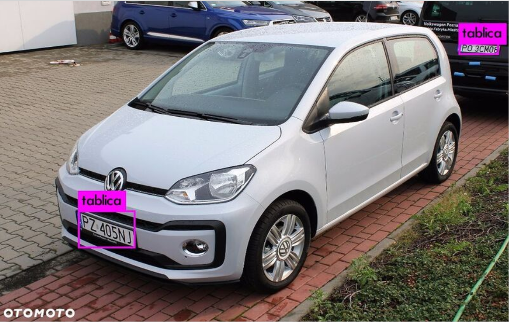
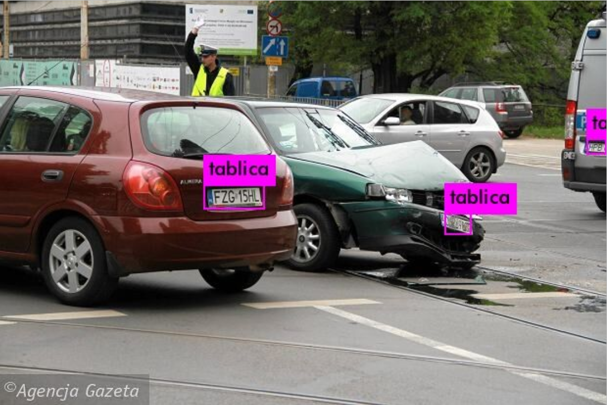
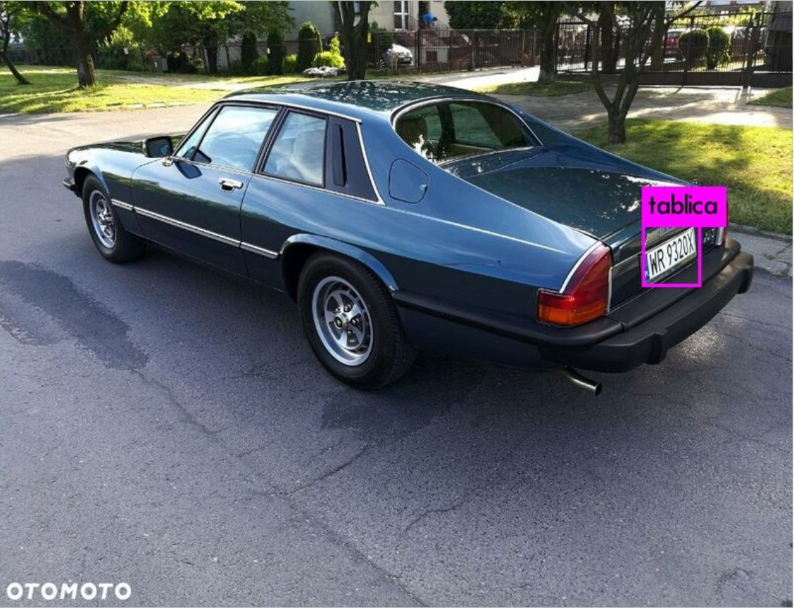
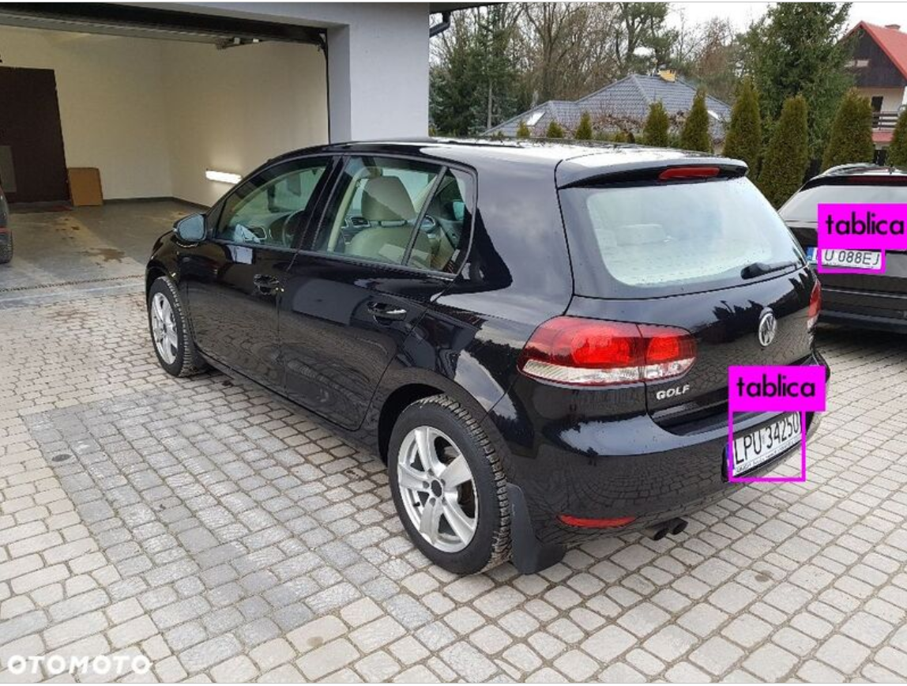
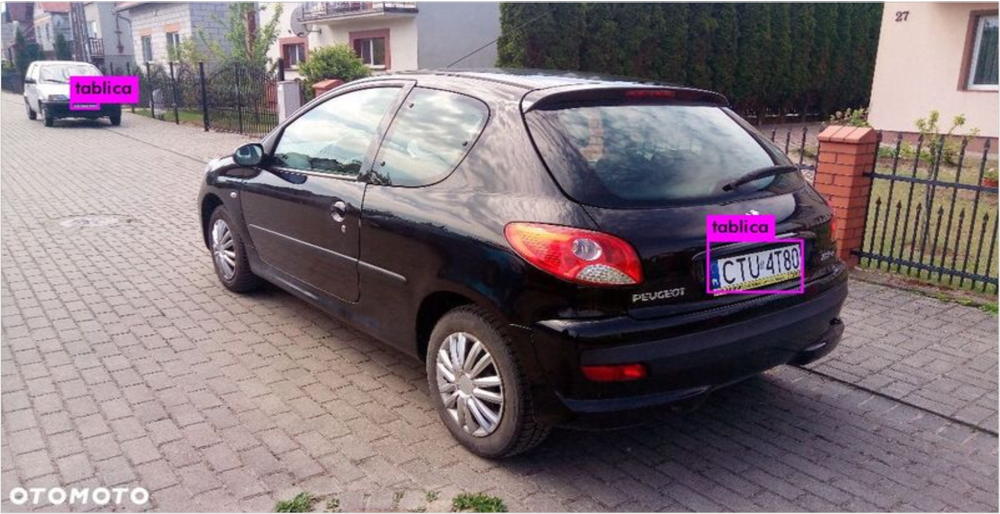

# Plate Detection

Program to detect plates on images with ocr.  link to to report in Polish [here!](report.pdf)

in project was used yolov3 (which source code was a bit modified and i wrote some new scripts in python)

# Darknet #
Darknet is an open source neural network framework written in C and CUDA. It is fast, easy to install, and supports CPU and GPU computation.

For more information see the [Darknet project website](http://pjreddie.com/darknet).

For questions or issues please use the [Google Group](https://groups.google.com/forum/#!forum/darknet).

## Examples 

